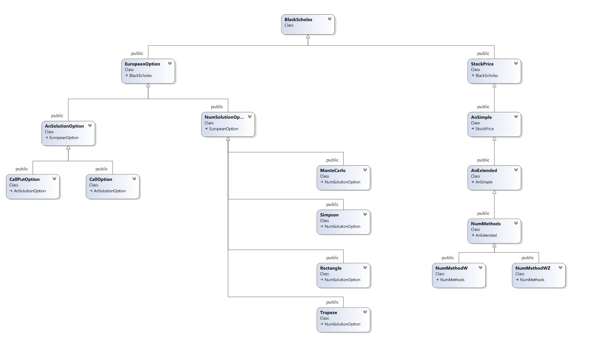
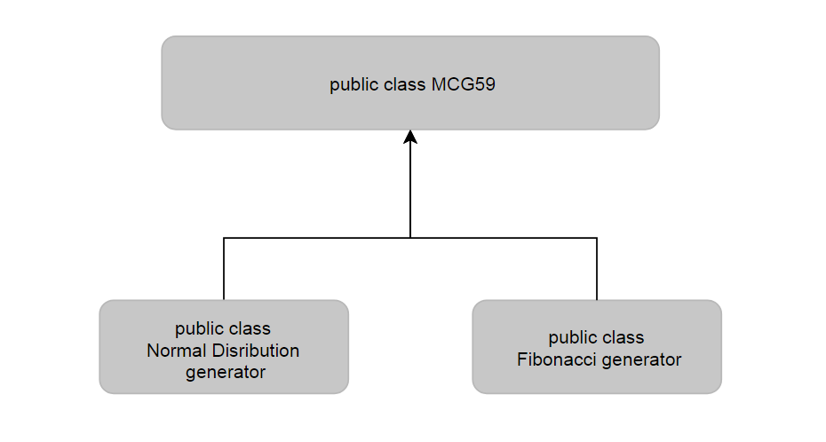
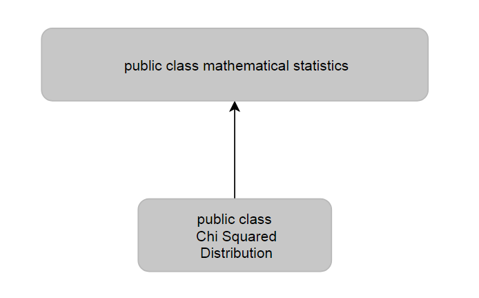

## A scientific work.

Usage of stochastic differential equations to solve applied problems of financial mathematics. Study of optimization methods of algorithms and their use in HPC. Generation of pseudorandom numerical sequences for Wiener process simulation. Automation of the collection of results, etc.
***
#### Wiki articles:
- European option launches in Intel Endevour:
https://docs.google.com/spreadsheets/d/1cyqg6_U_4KkqlE3AC1lzdAuw6ErCmqaRdwSgqs3Kuyc/edit?usp=sharing 
***
###### ***Stories to research:***
<!-- MarkdownTOC autolink="true" bracket="round" depth="5"-->
- Variance decrease methods
- Confidence intervals
- European max call option
<!-- /MarkdownTOC -->
***

###### ***Known issues:***
<!-- MarkdownTOC autolink="true" bracket="round" depth="5"-->
- How to build static lib containing MKL without 3500+ compiler warnings 
    - Solution: use specify Intel tool
    - WA: disable pragma
- Research `Warning LNK4221` : ```This object file does not define any previously undefined public symbols, so it will not be used by any link operation that consumes this library```
- Researc why after redefinition ```h = TIME / NSTEPS``` brokes calculating of Numerical Methods
- Research `Warning LNK4075` : ```ignoring '/EDITANDCONTINUE' due to '/OPT:LBR' specification```
- Option Price obtained by the Trapeze method greater by 8e-02 compared to the rest
- Optimize code
<!-- /MarkdownTOC -->
***
##### Requirements:
<!-- MarkdownTOC autolink="true" bracket="round" depth="5"-->
- MKL Required
- Gtest.lib Required
- Intel Compiler Recommended
<!-- /MarkdownTOC -->
***
<!--##### ***Current Main Project Class Diagram***

***
###### ***Currnet Random Number Generators Class Diagram***

***
###### ***Current Math Statistics Class Diagram***

***
-->